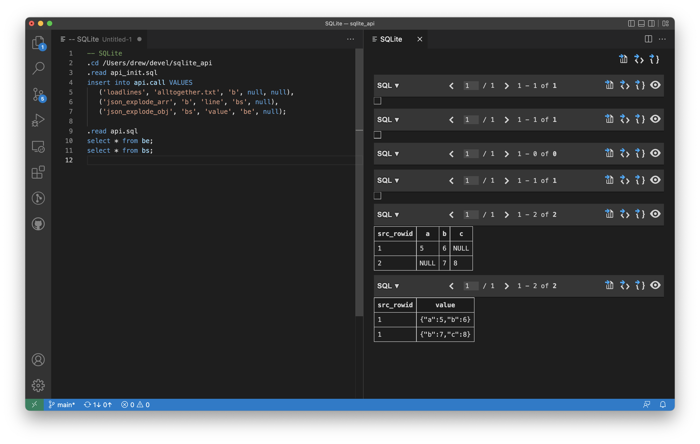

# sqlite_commands

While I've also got [sqlp](https://github.com/drewcsillag/sqlp), there
have been times where it's not been available for use, or weird things
have constrained things, such as the sqlite compiled into python being
"undercompiled" or "underfeatured", such that it's not been ideal in
all cases.

This was more of a way to think "If SQLite could have some notion of
stored procedures for at least command line use..."

So what can you do with this? 

All of this assumes you're using the `sqlite3` command-line tool.
First you have to initialize the api:

`.read api_init.sql` to make sure the api is initialized.

Also, it will drop files named `docall`_maybesomthinghere_`.out` in
the a directory in the current directory named `.sqlite_temp`.

## Load a file into a table where each row is a line

This will load the contents of the file `test.txt` into a table named `log`
(which it will create if it doesn't already exist) and put in one row per
line. The table has two columns `name` and `line` and `name` is the name of 
the file it was loaded from and `line` is the line from the file.

```
$ cat test.txt
This is line 1
This is another line
Yay, one more!
$ sqlite3 :memory:
sqlite> .read api_init.sql
sqlite> insert into api.call(func, arg1, arg2) values ('loadlines', 'test.txt', 'log');
sqlite> .read api.sql
sqlite> select * from log;
+----------+----------------------+
|   name   |         line         |
+----------+----------------------+
| test.txt | This is line 1       |
| test.txt | This is another line |
| test.txt | Yay, one more!       |
+----------+----------------------+
```

## Load a file with colon delimiters into a table
There are a few file formats that have _something_ followed by a `:` followed 
by the rest of a line. The output of `grep` and `gsh` do this, but there are 
others.

The arguments to put in the `api.call` table are
  * func: `split_on_colon`
  * arg1: the table we're going to split from
  * arg2: the columns from that table to carry over into the new table
  * arg3: the column in the original table to split on the colon
  * arg4: the name of the table to be created
  * arg5: the name of the column in the new table that will hold the text
       between the beginning of the line and the first colon
The remainder of the line from whence we split will be put in a column named `line`.

For example, if you grepped the source code for WHERE statements like this:
```
$ grep -n WHERE *.sql > glog.txt
```
And the first few lines of `glog.txt` would look like this:
```
api.sql:13:  FROM api.call) fmin WHERE fmin.m = api.call.rowid;
api.sql:18:WHERE a = 0;
api.sql:21:DELETE from api.call WHERE rowid = (select min(rowid) from api.call);
api.sql:27:) WHERE a = 0;
api.sql:42:-- ' as line from api._call)) WHERE a = 0;
api_init.sql:3:SELECT * from (SELECT writefile('.sqlite_temp/marker', '') as x) WHERE x=1;
call_json_explode_arr.sql:19:    WHERE json_valid(z.`" || THE_COLUMN || "`)
call_json_explode_arr.sql:22:)) WHERE a = 0
call_json_explode_obj.sql:12:--   WHERE
call_json_explode_obj.sql:39:      END AS THE_WHERE
```

You can do this:
```
sqlite> .read api_init.sql
sqlite> insert into api.call VALUES
   ...>    ('loadlines_colon', 'glog.txt', 'b', null, null),
   ...>    ('split_on_colon', 'b', 'name', 'line', 'bs', 'file');
sqlite> .read api.sql
sqlite> select * from bs;
+-----------+----------+---------------------------+---------------------------------------------------------------------------------------------------------------+
| src_rowid |   name   |           file            |                                                     line                                                      |
+-----------+----------+---------------------------+---------------------------------------------------------------------------------------------------------------+
| 1         | glog.txt | api.sql                   | 13:  FROM api.call) fmin WHERE fmin.m = api.call.rowid;                                                       |
| 2         | glog.txt | api.sql                   | 18:WHERE a = 0;                                                                                               |
| 3         | glog.txt | api.sql                   | 21:DELETE from api.call WHERE rowid = (select min(rowid) from api.call);                                      |
| 4         | glog.txt | api.sql                   | 27:) WHERE a = 0;                                                                                             |
| 5         | glog.txt | api.sql                   | 42:-- ' as line from api._call)) WHERE a = 0;                                                                 |
| 6         | glog.txt | api_init.sql              | 3:SELECT * from (SELECT writefile('.sqlite_temp/marker', '') as x) WHERE x=1;                                 |
| 7         | glog.txt | call_json_explode_arr.sql | 19:    WHERE json_valid(z.`" || THE_COLUMN || "`)                                                             |
| 8         | glog.txt | call_json_explode_arr.sql | 22:)) WHERE a = 0                                                                                             |
| 9         | glog.txt | call_json_explode_obj.sql | 12:--   WHERE                                                                                                 |                                                                                      |
... more lines here ...
```

If we were doing `gsh` or `grep` without the `-n`, we'd be all good, but here, the line column starts with *number*:, which 
isn't wonderful. We can do `split_on_colon` again, here we drop to column that only held `glog.txt` by only carrying the column 
named `file` into the new table.

```
sqlite> insert into api.call VALUES
   ...>    ('split_on_colon', 'bs', 'file', 'line', 'bss', 'lineno');
sqlite> .read api.sql
sqlite> select * from bss;
+-----------+---------------------------+--------+------------------------------------------------------------------------------------------------------------+
| src_rowid |           file            | lineno |                                                    line                                                    |
+-----------+---------------------------+--------+------------------------------------------------------------------------------------------------------------+
| 1         | api.sql                   | 13     |   FROM api.call) fmin WHERE fmin.m = api.call.rowid;                                                       |
| 2         | api.sql                   | 18     | WHERE a = 0;                                                                                               |
| 3         | api.sql                   | 21     | DELETE from api.call WHERE rowid = (select min(rowid) from api.call);                                      |
| 4         | api.sql                   | 27     | ) WHERE a = 0;                                                                                             |
| 5         | api.sql                   | 42     | -- ' as line from api._call)) WHERE a = 0;                                                                 |
| 6         | api_init.sql              | 3      | SELECT * from (SELECT writefile('.sqlite_temp/marker', '') as x) WHERE x=1;                                |
| 7         | call_json_explode_arr.sql | 19     |     WHERE json_valid(z.`" || THE_COLUMN || "`)                                                             |
| 8         | call_json_explode_arr.sql | 22     | )) WHERE a = 0                                                                                             |
| 9         | call_json_explode_obj.sql | 12     | --   WHERE                                                                                                 |

```
## Explode a column of json arrays into rows
This will take arrays from the table and column named in arg1 and arg2 respectively, and create
a new table (arg3) with a single column named `value` that has each of the array items in a separate row.

The `src_rowid` column has the value of the `rowid` column from where the data originated from.
```
sqlite> create table foo (data);
sqlite> insert into foo (data) values ('[1,2]'), ('[3,4]');
sqlite> insert into api.call (func, arg1, arg2, arg3) values ('json_explode_arr', 'foo', 'data', 'exfoo');
sqlite> .read api.sql
sqlite> select * from exfoo;
+-----------+-------+
| src_rowid | value |
+-----------+-------+
| 1         | 1     |
| 1         | 2     |
| 2         | 3     |
| 2         | 4     |
+-----------+-------+
```

## Explode a column of json objects into a table where every top level key is column

The `src_rowid` column has the value of the `rowid` column from where the data originated from.
```
sqlite> create table bar (data);
sqlite> insert into bar (data) values ('{"a": 5, "b": 6}'), ('{"b": 7, "c":8}');
sqlite> insert into api.call(func, arg1, arg2, arg3) values ('json_explode_obj', 'bar', 'data', 'exbar');
sqlite> .read api.sql
sqlite> select * from exbar;
+-----------+---+---+---+
| src_rowid | a | b | c |
+-----------+---+---+---+
| 1         | 5 | 6 |   |
| 2         |   | 7 | 8 |
+-----------+---+---+---+
```

You can also supply a value to `arg4` in the `api.call` table to have it exclude rows in the output 
where the input json object was empty, avoiding a bunch of rows that would otherwise contain just
a `src_rowid` value. The value supplied merely needs to be not `NULL`.

## Print a value
```
sqlite> insert into api.call (func, arg1) values ('print', 'HELLO!');
sqlite> .read api.sql
HELLO!
```

## Do nothing

Just does nothing.
```
sqlite> insert into api.call (func) values ('noop');
sqlite> .read api.sql
```

# What Got Skipped?
`json_explode_arr` and `json_explode_obj` skip non-JSON rows, as well as JSON
things that are not arrays or objects, respectively. You might want to check
to know what if anything got skipped.

If `f` is the original table, `t` the original column, and `o` the new table, you can run this query to
find the rows in the original table that were skipped.
```
SELECT f.t
FROM f
LEFT OUTER JOIN o ON f.rowid = o.src_rowid
WHERE o.src_rowid IS NULL;
```

# How does it work?

In short, by making heavy use of `writefile`, generating more sql with a
`SELECT`, and then calling `.read` with the file specified in
`writefile`. The simplest case is in `api.sql` itself. Some of the
`writefile` calls generate other calls to `writefile` and `.read` with a
generated filename based on func. But the main dispatch on the function
name just prepends
it with `call_` and suffixes it with `.sql`.

The downstream commands, except `noop` then basically repeat the
pattern, doing `writefile` in a `SELECT` to generate
more sql that it later `.read`s. In the case of `json_explode_obj`, it
actually goes one level deeper to do all it does.

I suspect you could get to full recursion if you wrote to the same
named file at every level, but so far haven't tried it.

# Putting it all together

If you insert multiple instructions into the `api.call` table, you can
string together as series of operations. For example, we'll start with
a file named `alltogether.txt` containing:
```
[{"a": 5, "b": 6}, {"b": 7, "c":8}]
```

```
sqlite> .read api_init.sql
sqlite> insert into api.call(func, arg1, arg2, arg3) values 
-- load in the file
    ('loadlines', 'alltogether.txt', 'b', NULL),
-- split the array into rows
    ('json_explode_arr', 'b', 'line', 'bs'),
-- explode the json into columns	
    ('json_explode_obj', 'bs', 'value', 'battrs');
sqlite> .read api.sql
sqlite> select * from b;
+-----------------+-------------------------------------+
|      name       |                line                 |
+-----------------+-------------------------------------+
| alltogether.txt | [{"a": 5, "b": 6}, {"b": 7, "c":8}] |
+-----------------+-------------------------------------+
sqlite> select * from bs;
+-----------+---------------+
| src_rowid |     value     |
+-----------+---------------+
| 1         | {"a":5,"b":6} |
| 1         | {"b":7,"c":8} |
+-----------+---------------+
sqlite> select * from battrs;
+-----------+---+---+---+
| src_rowid | a | b | c |
+-----------+---+---+---+
| 1         | 5 | 6 |   |
| 2         |   | 7 | 8 |
+-----------+---+---+---+
```

# Miscellaneous
You probably don't want to have to copy this all around any time you want to use it. So what can do is
use the `api.config` table to tell the api where to load its files from.

So if your sqlite_api directory is a subdirectory of the current directory, you can
do something like this:
```
.read sqlite_api/api_init.sql
insert into api.config (path) VALUES ('./sqlite_api/');
... insert your calls into api.call ...
.read sqlite_api/api.sql
```

# VSCode
If you install the `vscode-sqlite` plugin in vscode, you'll want
to use the `.cd` command so it runs where you think, but it works.


